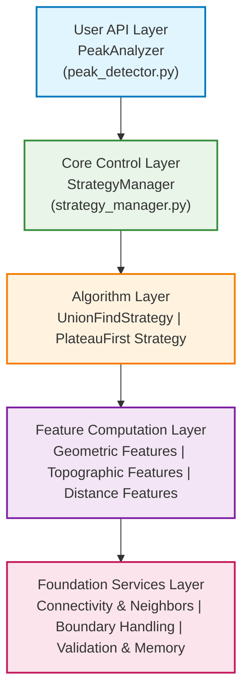
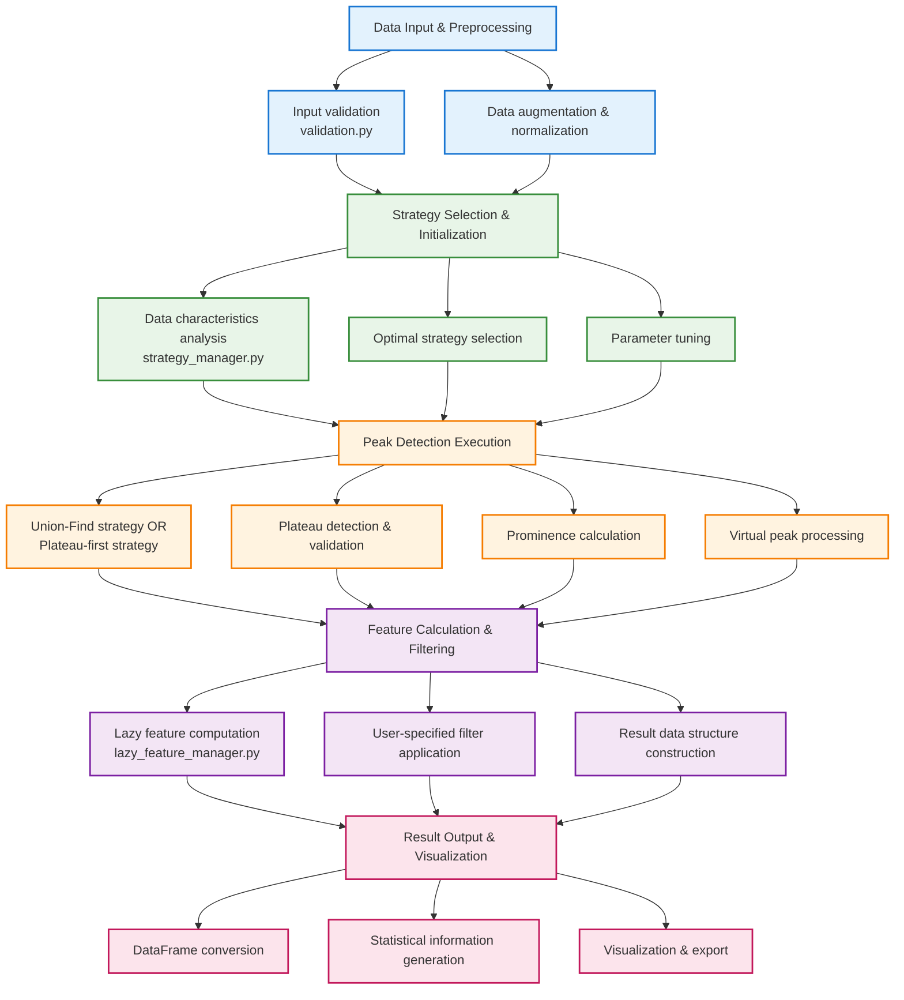

# Software Architecture Design

_← [Back to Algorithm](../algorithms/algorithm.md) | [日本語版](architecture_ja.md) →_

## Architecture Overview

PeakAnalyzer employs a layered, modular architecture that provides a comprehensive framework for topographic peak detection. Each layer has clearly separated responsibilities, ensuring extensibility and maintainability.



## Directory Structure and Responsibility Separation

```
peak_analyzer/
├── peak_analyzer/                    # Main package
│   ├── __init__.py                   # Package entry point
│   ├── models/                      # Central data structure definitions
│   │   ├── __init__.py              # Package entry point
│   │   ├── peaks.py                 # Peak detection results
│   │   └── data_analysis.py         # Analysis metadata structures
│   ├── api/                         # User API Layer
│   │   ├── peak_detector.py         # Main analysis class
│   │   ├── result_dataframe.py      # Result dataframe processing
│   │   └── parameter_validation.py  # Parameter validation
│   │
│   ├── core/                        # Core Algorithm Layer
│   │   ├── strategy_manager.py      # Strategy selection & management
│   │   ├── plateau_detector.py      # Plateau detection core
│   │   ├── prominence_calculator.py # Prominence calculation core
│   │   ├── virtual_peak_handler.py  # Virtual peak processing
│   │   └── union_find.py           # Connected component data structure
│   │
│   ├── strategies/                  # Detection Strategy Implementation Layer
│   │   ├── base_strategy.py         # Strategy base class
│   │   ├── union_find_strategy.py   # Union-Find strategy
│   │   ├── plateau_first_strategy.py # Plateau-first strategy
│   │   └── strategy_factory.py      # Strategy factory
│   │
│   ├── features/                     # Feature Calculation Layer
│   │   ├── base_calculator.py       # Calculation base class
│   │   ├── geometric_calculator.py  # Geometric features
│   │   ├── topographic_calculator.py # Topographic features
│   │   ├── morphological_calculator.py # Morphological features
│   │   ├── distance_calculator.py   # Distance & connectivity features
│   │   └── lazy_feature_manager.py  # Lazy computation manager
│   │
│   ├── connectivity/                 # Connectivity Definition Layer
│   │   ├── connectivity_types.py    # N-dimensional connectivity definitions
│   │   └── neighbor_generator.py    # Simplified neighbor generation
│   │
│   ├── coordinate_system/           # Coordinate System Layer
│   │   ├── grid_manager.py         # Index ↔ Coordinate conversion & spatial operations
│   │   ├── coordinate_mapping.py   # Mapping definitions and validation
│   │   └── spatial_indexing.py     # Spatial indexing and search acceleration
│   │
   ├── data/                       # Data Management Layer
   │   └── validation.py           # Input validation
   │
   └── utils/                      # Utility Layer
       └── general.py              # General utility functions
│
├── tests/                          # Test Suite
│   ├── unit/                      # Unit tests
│   ├── integration/               # Integration tests
│   ├── performance/               # Performance tests
│   └── fixtures/                  # Test data
│
├── examples/                       # Usage Examples & Demos
│   ├── basic_usage.py             # Basic usage
│   ├── advanced_features.py       # Advanced features
│   ├── custom_strategies.py       # Custom strategies
│   └── benchmarking.py           # Benchmark examples
│
├── docs/                          # Documentation
│   ├── api/                      # API specifications
│   ├── tutorials/                # Tutorials
│   ├── algorithms/               # Algorithm details
│   └── examples/                 # Detailed examples
│
└── benchmarks/                    # Performance Benchmarks
    ├── synthetic_data/           # Synthetic data tests
    ├── real_world_data/          # Real-world data tests
    └── comparison_studies/       # Comparative studies
```

## Layer-by-Layer Detailed Specifications

### 1. **api/** - User API Layer
Provides unified interface for topographic peak analysis

**models/**: Central data structure definitions
- **peaks.py**: Peak detection result structures (Peak, VirtualPeak, SaddlePoint)
- **data_analysis.py**: Analysis metadata structures (DataCharacteristics, BenchmarkResults)

### 2. **core/** - Core Algorithm Layer
Implements core algorithms for topographic analysis

**strategy_manager.py**: Strategy selection & management
**plateau_detector.py**: Plateau detection core
**prominence_calculator.py**: Prominence calculation core
**virtual_peak_handler.py**: Virtual peak processing

### 3. **strategies/** - Detection Strategy Implementation Layer
Optimized detection algorithms for different data characteristics

**base_strategy.py**: Common strategy interface
**union_find_strategy.py**: Union-Find strategy
**plateau_first_strategy.py**: Plateau-first strategy

### 4. **features/** - Feature Calculation Layer
Comprehensive computation framework for topographic features

**geometric_calculator.py**: Geometric features
**topographic_calculator.py**: Topographic features
**distance_calculator.py**: Distance & connectivity features

### 5. **connectivity/** - Connectivity Definition Layer
Connectivity in N-dimensional space

### 6. **coordinate_system/** - Coordinate System Layer
Unified management of index space and coordinate space transformations

**grid_manager.py**: Index ↔ Coordinate conversion and spatial operations
**coordinate_mapping.py**: Mapping definitions
**spatial_indexing.py**: Spatial indexing and search acceleration

### 7. **data/** - Data Management Layer
Input validation and data preprocessing

**validation.py**: Input validation and data preprocessing

### 8. **utils/** - Utility Layer
General utility functions

**general.py**: Common utility functions and helpers

## Data Flow and Interactions



## Performance Optimization Features

- **Adaptive Strategy Selection**: Automatic optimal algorithm selection based on data characteristics
- **Lazy Evaluation**: Efficient memory usage by computing only required features
- **Multi-threading**: Parallelization of CPU-intensive computations
- **Caching System**: Intelligent caching of computational results
- **Memory Optimization**: Chunk processing for large-scale datasets
- **Profiling**: Real-time performance monitoring and bottleneck identification