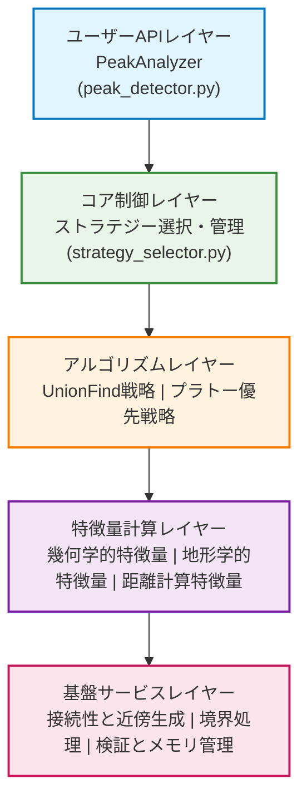
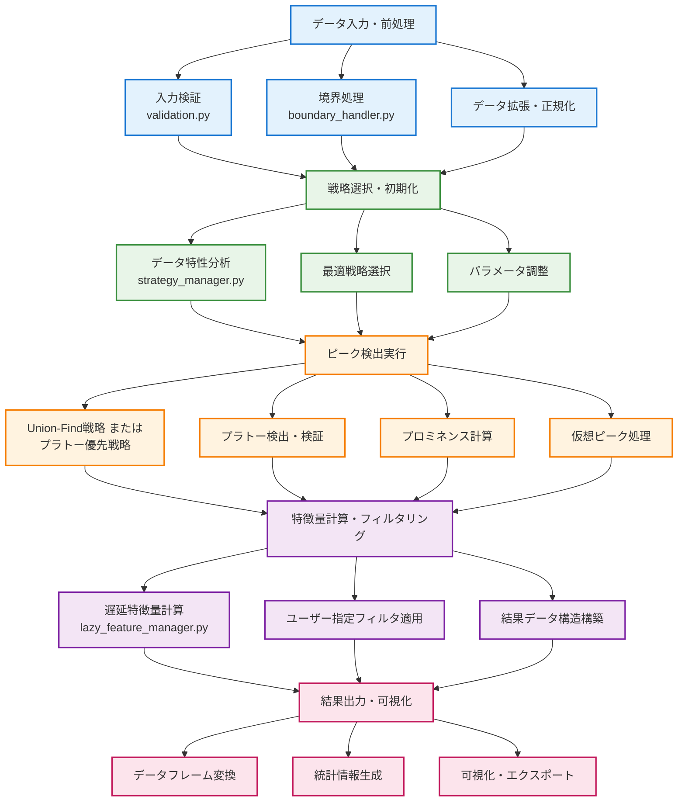

# ソフトウェアアーキテクチャ設計

_← [アルゴリズム](../algorithms/algorithm_ja.md) | [English Version](architecture.md) →_

## アーキテクチャ概要

PeakAnalyzerは階層化されたモジュラーアーキテクチャを採用し、地形ピーク検出のための包括的なフレームワークを提供します。各レイヤーは明確に責任を分離し、拡張性と保守性を確保します。



## ディレクトリ構造と責任分離

```
peak_analyzer/
├── peak_analyzer/                    # メインパッケージ
│   ├── __init__.py                   # パッケージエントリーポイント
│   ├── models/                      # 中央データ構造定義
│   │   ├── __init__.py              # パッケージエントリーポイント
│   │   ├── peaks.py                 # ピーク検出結果構造
│   │   └── data_analysis.py         # 解析メタデータ構造
│   ├── api/                         # ユーザーAPIレイヤー
│   │   ├── peak_detector.py         # メイン解析クラス
│   │   ├── result_dataframe.py      # 結果データフレーム処理
│   │   └── parameter_validation.py  # パラメータ検証
│   │
│   ├── core/                        # コアアルゴリズムレイヤー
│   │   ├── strategy_manager.py      # 戦略選択・管理
│   │   ├── plateau_detector.py      # プラトー検出コア
│   │   ├── prominence_calculator.py # プロミネンス計算コア
│   │   ├── virtual_peak_handler.py  # 仮想ピーク処理
│   │   └── union_find.py           # 連結成分データ構造
│   │
│   ├── strategies/                  # 検出戦略実装レイヤー
│   │   ├── base_strategy.py         # 戦略基底クラス
│   │   ├── union_find_strategy.py   # Union-Find戦略
│   │   ├── plateau_first_strategy.py # プラトー優先戦略
│   │   ├── hybrid_strategy.py       # ハイブリッド戦略
│   │   └── strategy_factory.py      # 戦略ファクトリー
│   │
│   ├── features/                     # 特徴量計算レイヤー
│   │   ├── base_calculator.py       # 計算基底クラス
│   │   ├── geometric_calculator.py  # 幾何学的特徴量
│   │   ├── topographic_calculator.py # 地形学的特徴量
│   │   ├── morphological_calculator.py # 形態学的特徴量
│   │   ├── distance_calculator.py   # 距離・接続特徴量
│   │   └── lazy_feature_manager.py  # 遅延計算マネージャー
│   │
│   ├── connectivity/                 # 接続性定義レイヤー
│   │   ├── connectivity_types.py    # N次元接続性定義
│   │   ├── neighbor_generator.py    # 近傍生成器
│   │   ├── path_finder.py          # パス探索アルゴリズム
│   │   └── distance_metrics.py      # 距離メトリック実装
│   │
│   ├── coordinate_system/           # 座標系レイヤー
│   │   ├── grid_manager.py         # インデックス ↔ 座標変換・空間操作
│   │   ├── coordinate_mapping.py   # マッピング定義・検証
│   │   └── spatial_indexing.py     # 空間インデックス・検索高速化
│   │
│   ├── boundary/                    # 境界処理レイヤー
│   │   ├── boundary_handler.py      # 境界条件処理
│   │   ├── edge_detector.py        # エッジ効果検出
│   │   ├── padding_strategies.py   # パディング戦略
│   │   └── artifact_filter.py      # アーティファクト除去
│   │
│   ├── data/                       # データ管理レイヤー
│   │   ├── lazy_dataframe.py       # 遅延評価データフレーム
│   │   ├── peak_collection.py      # ピーク集合管理
│   │   ├── cache_manager.py        # キャッシュ管理
│   │   └── memory_optimizer.py     # メモリ最適化
│   │
│   └── utils/                      # ユーティリティレイヤー
│       ├── validation.py           # 入力検証
│       ├── performance_profiler.py # パフォーマンスプロファイリング
│       ├── error_handling.py       # エラーハンドリング
│       ├── logging_config.py       # ログ設定
│       └── type_definitions.py     # 型定義
│
├── tests/                          # テストスイート
│   ├── unit/                      # ユニットテスト
│   ├── integration/               # 統合テスト
│   ├── performance/               # パフォーマンステスト
│   └── fixtures/                  # テストデータ
│
├── examples/                       # 使用例・デモ
│   ├── basic_usage.py             # 基本使用
│   ├── advanced_features.py       # 高度機能
│   ├── custom_strategies.py       # カスタム戦略
│   └── benchmarking.py           # ベンチマーク例
│
├── docs/                          # ドキュメント
│   ├── api/                      # API仕様
│   ├── tutorials/                # チュートリアル
│   ├── algorithms/               # アルゴリズム詳細
│   └── examples/                 # 詳細な例
│
└── benchmarks/                    # パフォーマンスベンチマーク
    ├── synthetic_data/           # 合成データテスト
    ├── real_world_data/          # 実世界データテスト
    └── comparison_studies/       # 比較研究
```

## レイヤー別詳細仕様

### 1. **api/** - ユーザーAPIレイヤー
地形ピーク解析のための統一インターフェースを提供

**models/**: 中央データ構造定義
- **peaks.py**: ピーク検出結果構造 (Peak, VirtualPeak, SaddlePoint)
- **data_analysis.py**: 解析メタデータ構造 (DataCharacteristics, BenchmarkResults)

### 2. **core/** - コアアルゴリズムレイヤー
地形解析のためのコアアルゴリズムを実装

**strategy_manager.py**: 戦略選択・管理
**plateau_detector.py**: プラトー検出コア
**prominence_calculator.py**: プロミネンス計算コア
**virtual_peak_handler.py**: 仮想ピーク処理

### 3. **strategies/** - 検出戦略実装レイヤー
異なるデータ特性に最適化された検出アルゴリズム

**base_strategy.py**: 共通戦略インターフェース
**union_find_strategy.py**: Union-Find戦略
**plateau_first_strategy.py**: プラトー優先戦略

### 4. **features/** - 特徴量計算レイヤー
地形特徴量の包括的計算フレームワーク

**geometric_calculator.py**: 幾何学的特徴量
**topographic_calculator.py**: 地形学的特徴量
**distance_calculator.py**: 距離・接続特徴量

### 5. **connectivity/** - 接続性定義レイヤー
N次元空間における接続性とパス探索

### 6. **coordinate_system/** - 座標系レイヤー
インデックス空間と座標空間の変換の統一管理

**grid_manager.py**: インデックス ↔ 座標変換と空間操作
**coordinate_mapping.py**: マッピング定義

### 7. **boundary/** - 境界処理レイヤー
データ境界での適切な処理

**boundary_handler.py**: 境界条件処理

### 8. **data/** - データ管理レイヤー
効率的なデータ処理とメモリ管理

**lazy_dataframe.py**: 遅延評価データフレーム

## データフローと相互作用



## パフォーマンス最適化機能

- **適応的戦略選択**: データ特性に基づく自動最適アルゴリズム選択
- **遅延評価**: 必要な特徴量のみを計算する効率的メモリ使用
- **マルチスレッド**: CPU集約的計算の並列化
- **キャッシュシステム**: 計算結果の知的キャッシング
- **メモリ最適化**: 大規模データセットのチャンク処理
- **プロファイリング**: リアルタイムパフォーマンス監視とボトルネック特定